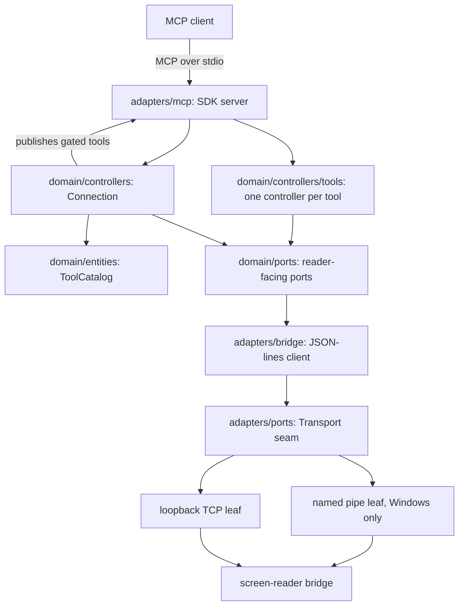

# Spec 0013 — server: the MCP chassis, in Go (entry 10)

Implementation contract for ROADMAP lane 2, entry 10 (session D). Authored on
the entry's branch per process; the spec rides in the first implementing PR
(10a) and is amended in place if delivery forces a change.

This spec **amends two Decided items** in [spec 0005](0005-multi-reader-direction.md)
— see "Amendments to spec 0005" at the end. Nothing else in 0005 changes.

## Goal

Lane 1 is complete: an NVDA bridge listens on a named pipe (or loopback TCP),
answers `hello` with its reader identity and capabilities, and serves the
commands in [the wire contract](wire/v1/protocol.md). Nothing dials it yet
except test scaffolding.

This entry delivers the other half — the MCP server an AI agent actually talks
to. It is a **reader-agnostic chassis** (0005): it dials one bridge, learns from
`hello` which screen reader answered and what that reader can do, and publishes
a matching set of MCP tools over stdio. It contains no NVDA knowledge, no JAWS
knowledge, and no `if reader == …` anywhere.

Three properties define it:

1. **One bridge session per process.** The endpoint is composition-root config;
   `hello` reports which reader actually answered. Driving two readers means
   running two server processes, which every MCP host already multiplexes by
   name.
2. **The advertised tool set is a function of the announced capabilities.** A
   reader without braille never shows a braille tool. The gate is keyed on
   capability strings, never on reader names.
3. **The bridge is expected to be absent at startup.** The MCP host launches
   the server long before the user has started NVDA, so connection is a
   background loop and the tool list grows and shrinks with it.

## Decided

Everything in this section was agreed in conversation on 2026-07-22 and is
settled per invariant 6.

### The server is written in Go

Reversing 0005's "the v1 server is Python", which parked a Go port for session
F. The reasons the earlier decision gave have expired or flipped:

- **The same-bytes drift guarantee is replaced, not lost.** 0005 kept Python so
  server and bridge could import the identical `protocol.py`. That guarantee now
  has a language-neutral successor already in the repo: `specs/wire/v1/schema.json`
  with its CI drift gate. This entry makes it load-bearing by **generating** the
  Go wire types from it (see below), which also makes the server the
  second-implementation stress test 0005 hoped a Go port would provide.
- **The published contract exists.** 0005 required it before a language switch;
  entry 8 delivered it.
- **The distribution problem it was deferring is now the deciding factor.** A
  statically linked binary removes the PyInstaller warts 0005 itself listed
  (artifact size, startup, antivirus false positives), and makes an `.mcpb`
  bundle and an umbrella installer trivial.
- **The official Go SDK is past 1.0** (`github.com/modelcontextprotocol/go-sdk`,
  v1.x, maintained with Google), with a published spec-version compatibility
  table. Rust's `rmcp` was considered and rejected: this server is a router —
  dial a pipe, pump JSON lines, fan out to MCP — which is goroutine-and-channel
  shaped, and Rust's ownership work buys guarantees this process does not need.
- **Toolchain accessibility.** `rustc` diagnostics are multi-line ASCII art
  (carets, underlines, gutters), which is hostile under a screen reader.
  `go build` emits one line per error. Compiler output is read thousands of
  times over a project's life; this is a real cost, not a preference.

The NVDA bridge stays Python forever regardless — it runs inside NVDA.

### The wire types are generated, and they live outside the server

`wire/go/` is a **separate Go module** at the repo root, generated from
`specs/wire/v1/schema.json` and regenerated by a CI drift gate that mirrors the
existing schema gate: regenerate, diff, fail on mismatch.

It is *not* `server/internal/wire`, and that is deliberate. A bridge is a role,
not a plugin: 0005's JAWS bridge is a free-standing external process whose
language is wide open, and a Go bridge (or a Go conformance harness) must be
able to import these types. Go's `internal/` is a hard compiler boundary that
would forbid exactly that. `wire/go/` is the Go peer of `shared/` — one
language binding of a contract whose canonical form is `specs/wire/v1/`.

### The domain never speaks wire types

The generated types are an **adapter** concern. The domain has its own
vocabulary, and adapters map between them.

This is the load-bearing rule for protocol evolution. Compatibility today is
exact `protocolVersion` equality ([protocol.md §8](wire/v1/protocol.md)), which
couples every bridge to every other bridge *through* the server: NVDA cannot
move to wire v2 until the server does, and when it does, every other bridge must
follow. The alternative — the server accepting a set of versions and negotiating
per session — decouples the bridges but makes the server a compatibility hub
that accretes codecs forever.

We are **not choosing between those yet**; one bridge exists and v1 is
pre-release. We are keeping the choice cheap:

- The supported set is a **set in code** (`SupportedVersions = []int{1}`)
  consulted by the handshake, not a constant compared with `==` at one call
  site.
- The domain imports nothing from `wire/go`. If it did, adding v2 would rewrite
  the domain and the decision would already be made for us.

Three version axes stay separate, and conflating them is the failure mode this
guards against:

| Axis | Who compares it | Where it lives |
|---|---|---|
| Wire `protocolVersion` | the handshake, for compatibility | `specs/wire/vN/` |
| Component versions (add-on, server) | nobody, ever — [spec 0012](0012-packaging-and-release.md) | each component's own manifest |
| Capabilities | the tool gate, for reader variation | `hello`'s `capabilities` |

**A reader difference is never a protocol version.** JAWS having no braille is a
capability, not a fork of the contract.

### One bridge session per process

The server owns exactly one live bridge connection. Tools take no target
parameter. The multi-reader story is multiple server processes:

```json
"mcpServers": {
  "nvda":     { "command": "screenreader-mcp.exe", "args": ["--endpoint", "pipe:nvdaMcpBridge"] },
  "talkback": { "command": "screenreader-mcp.exe", "args": ["--endpoint", "tcp:127.0.0.1:9010"] }
}
```

Alternatives considered and rejected for v1: a named endpoint map with a
`select_reader` tool (adds a mode the model can get wrong, buys little); and N
concurrent sessions with a target parameter on every tool (collapses the
capability-gated tool list into a union with per-call errors, and makes buffers,
indices and reconnect state per-target).

What this gives up is **only server-side coordination** — a synchronized start
across readers, one transcript spanning both, a "compare these two readers"
tool. It does *not* give up cross-reader work in a single agent conversation:
the MCP host exposes both tool sets at once, so the agent drives NVDA and reads
back TalkBack by calling two namespaced tools. That is most of why concurrent
sessions look overpriced.

Two ATs on one Windows machine is hostile anyway — both hook the keyboard, both
speak, and `pressGesture` lands wherever focus is. Real multi-reader work is
multi-**host** (NVDA on the desktop, TalkBack on a phone over `adb`), which
process-per-bridge serves natively.

**Constraint that keeps concurrency reachable:** one `Session` value owning one
bridge connection, built by the composition root, with **zero package-level
state** — no global "current reader", no singleton buffer, no `init()` side
effects. Then N sessions later is a map plus a routing parameter, which is the
"the only code is a lookup" 0005 promised.

### Capability handling: gate the list, surface the identity, error as a backstop

Three mechanisms, in order of how the agent meets them:

1. **Gate the tool list.** Only tools whose capability is in the announced set
   are advertised. Publication is driven by `hello`, and the list changes as the
   bridge connects and disconnects.
2. **Surface the reader.** A `screenreader://info` resource carries reader name
   and version, capabilities, capture mode, synth, protocol version, and both
   session log paths. The agent already knows NVDA's browse/focus mode and
   JAWS's forms mode from training — 0005 principle 2 says hand it the name and
   let it use that knowledge.
3. **Error as a backstop.** A capability can vanish mid-session when the bridge
   dies between `tools/list` and a call, so every tool still checks and returns
   a structured "this reader does not support `<capability>`" error.

`initialize.instructions` was considered for identity and rejected: it is frozen
at handshake time, and the bridge usually connects later.

### The bridge is absent at startup; the server stays alive anyway

The lifecycle, which the reconnect controller implements:

1. Start, serve MCP immediately, advertise only the ungated tools (`status`).
2. Attempt to connect in the background; retry with backoff, forever.
3. On a successful `hello`: verify the protocol version, record identity and
   capabilities, publish the gated tools (the SDK emits `tools/list_changed`).
4. On disconnect or read error: retract the gated tools, return to step 2.
5. **Never exit** on a bridge problem. A process that dies gets restarted in a
   loop by the MCP host, which is strictly worse than a process that reports
   "no bridge". Only stdin EOF (the host closing the server) ends it.

Protocol mismatch is a *reported* failure, not a crash: `status` says "bridge
speaks protocol 2, this server speaks 1" and the loop keeps retrying, so
restarting the add-on fixes it without restarting the host.

### stdout belongs to JSON-RPC

Every diagnostic goes to stderr or a file. A single stray `fmt.Println` corrupts
the MCP stream. The `Log` port exists so the domain cannot reach `os.Stdout` by
accident.

### The pipe leaf is Windows-only, by build tag

`Transport` is a seam in `adapters/ports/`; the TCP leaf is portable, the named
pipe leaf is `//go:build windows` with a non-Windows stub that fails endpoint
construction with a clear message. The module builds and unit-tests on Linux;
only the conformance job needs Windows. This is not CI convenience — a future
VoiceOver or TalkBack bridge implies a non-Windows server host, and 0005 already
frames the endpoint as composition-root config.

### Repo layout: `server/` beside `bridges/`

The asymmetry is meaningful: `bridges/` is plural because readers are many,
`server/` is singular because 0005 makes it one chassis. It also matches the
`server-v*` tag namespace [spec 0012](0012-packaging-and-release.md) already
reserved.

The Python `mcpServer/` scaffold (a `pyproject.toml`, an empty package, a smoke
test) is **deleted** in 10a. `shared/` keeps its name: with the server in Go it
is no longer shared between the halves, but a bridge's language is open — a JAWS
bridge could well be Python — so it remains the Python binding of the wire
contract rather than becoming NVDA-specific. Renaming it to `wire/python/` for
symmetry with `wire/go/` is a **deferred cleanup**, not part of this entry; it
touches the sconstruct, `sync_shared.py`, the uv workspace and the `shared` CI
job for zero behaviour change.

### Version source for the `server-v*` tag

[Spec 0012](0012-packaging-and-release.md) requires the version to live in the
component's own manifest and nowhere else, verified against the tag. Go has no
`buildVars.py`, so the equivalent is a single `const Version` in
`server/internal/version/version.go`, surfaced by `--version`. The release
workflow builds the binary and runs `--version` to compare against the tag,
which also proves the artifact runs before it is published.

### The module path may need a rename later

`module github.com/marlon-sousa/screen-readers-mcp/server` is written today.
0005 lists the repo name as Open; a rename is `go mod edit -module` plus a
mechanical import rewrite, nothing imports us externally, and GitHub redirects
keep `go get` working. Not a reason to block this entry.

## Architecture



### The four roles, rendered in Go

AGENTS.md's vocabulary (port / controller / entity / adapter) holds unchanged;
only the mechanics differ:

| Rule (Python) | Go rendering |
|---|---|
| Ports are `abc.ABC` with `@abstractmethod` | Ports are interfaces in `domain/ports/`, one per file. An incomplete adapter is caught at compile time by a `var _ ports.X = (*Impl)(nil)` assertion in the adapter's file — required, not optional. |
| One class per file, no re-export facades | One interface/type per file; packages export directly, no facade packages. |
| `tests/unit/` mirrors the source tree | Go's own convention *is* the mirror: `session.go` ↔ `session_test.go` beside it, one test file per source file. The intent (path answers "which test covers this?") is satisfied; a parallel tree would fight the toolchain. |
| Fakes in `tests/fakes/`, one per port, subclassing the ABC | `internal/fakes/`, one file per port, each with the compile-time assertion. Imported only by tests. |
| Builders in `tests/support/` | `internal/testsupport/`. |
| `wiring.py` is the composition root | `internal/wiring/wiring.go`, read top to bottom. No DI library, same reasoning. |
| Time is injected, never patched | A `Clock` port with a fake whose `Sleep` is an instant advance. Real code uses the port; tests never use `time.Sleep`. |
| Enumerations are `enum` | Typed string constants with a `String()` method; the generated wire enums stay in `wire/go`. |

House style: `gofmt` (tabs, by definition), `go vet` clean, and `staticcheck` in
CI. Every file header states its **role and its relationships** — which port it
implements, what it depends on, who builds it, who calls it — exactly as
AGENTS.md requires of the bridge.

## Delivery — three sequential PRs

Delivered as three PRs on one spec, per the short-PR principle and the 9a/9b/9c
precedent. Lane 2 keeps at most one open PR at a time.

- **10a** — the module, the generated wire types, and the bridge client: it can
  dial a bridge and complete a handshake, proven headlessly. No MCP surface.
- **10b** — the MCP surface: tools, gate, resource, reconnect lifecycle.
- **10c** — cross-language conformance in CI against the real Python bridge,
  plus release plumbing; flips the board entry.

## Deliverables — 10a: module, wire types, bridge client

### 1. `wire/go/` — generated wire types (separate module)

`module github.com/marlon-sousa/screen-readers-mcp/wire/go`. Generated from
`specs/wire/v1/schema.json`, committed, with `go:generate` and a CI drift gate
(regenerate, `git diff --exit-code`). Contains envelope types (`Request`,
`Response`), per-command params/result structs, the command and capability
string constants, and `SupportedVersions`. **No behaviour** beyond
marshal/unmarshal — this is the contract's Go binding, nothing else.

A root `go.work` ties `./wire/go` and `./server` together for local development;
published module paths stay honest.

### 2. `server/internal/domain/ports/` — the reader-facing ports

One interface per file, all in domain vocabulary. Their DTOs live beside them
(AGENTS.md's rule that a port's own types live in its file):

| File | Role | Notes |
|---|---|---|
| `session_dialer.go` | port — dial a bridge and complete the handshake | Returns a `ReaderSession` value (identity, capabilities, mode, synth, log paths) or an error. Owns `ProtocolMismatchError`. |
| `speech_reader.go` | port — speech capability | `SpeechSince`, `LastSpeech`, `NextSpeechIndex`, `WaitForSpeech`, `WaitForSpeechToFinish`. |
| `braille_reader.go` | port — braille capability | `BrailleSince`. |
| `gesture_sender.go` | port — gestures capability | `PressGestures([]string)`; ids are opaque. |
| `focus_inspector.go` | port — focus capability | `FocusInfo()`. |
| `state_inspector.go` | port — state capability | `State()`. |
| `config_accessor.go` | port — config capability | `GetConfig(keyPath)`, `SetConfig(keyPath, value)`. |
| `clock.go` | port — time | `Now`, `Sleep`, injected everywhere; never `time.Sleep`. |
| `log.go` | port — diagnostics | Keeps the domain away from `os.Stdout`. |

Splitting by capability group (rather than one fat `BridgeClient`) mirrors the
bridge's own port set and makes the gate's shape obvious. One adapter implements
them all.

### 3. `server/internal/domain/entities/` — the pure model

| File | Role | Notes |
|---|---|---|
| `reader_session.go` | entity — what `hello` established | Reader name/version, capability set, mode, synth, `logPath`, `nvdaLogPath`, bridge protocol version. Immutable value. |
| `capability.go` | entity — the capability vocabulary | Typed constants for the six groups, plus `Set` with `Has`. Unknown strings are retained and ignored, per protocol.md §4. |
| `connection_state.go` | entity — the lifecycle state machine | `Disconnected` / `Connecting` / `Connected` / `Incompatible`, with the reason string `status` reports. |

### 4. `server/internal/adapters/ports/transport.go` — the adapter seam

The byte-level seam between the JSON-lines client and the OS. `Read`, `Write`,
`Close`, with a `Dial`-side `Endpoint` type. The domain never sees it.

### 5. `server/internal/adapters/bridge/` — the JSON-lines client

| File | Role | Notes |
|---|---|---|
| `json_lines_client.go` | adapter — implements every port in §2 | Holds all the decisions: correlation ids, request/response matching, framing, timeouts, and the **wire↔domain mapping**. Unit-tested against a fake `Transport`. |
| `handshake.go` | adapter — `hello` exchange | Sends the server's `protocolVersion` and capture mode, validates the reply against `SupportedVersions`, builds a `ReaderSession`. Raises `ProtocolMismatchError` on disagreement. |
| `endpoint.go` | adapter — endpoint parsing | `pipe:<name>` and `tcp:<host>:<port>` into a `Transport` factory; rejects non-loopback TCP hosts. |
| `tcp_transport.go` | adapter **leaf** — real socket | No decisions; nothing to unit-test. |
| `pipe_transport_windows.go` | adapter **leaf** — real named pipe | `//go:build windows`, via `go-winio` (pure Go, keeps `CGO_ENABLED=0`). |
| `pipe_transport_other.go` | adapter **leaf** — stub | `//go:build !windows`; returns "named pipes are Windows-only". |

The upper/leaf split is AGENTS.md's rule applied unchanged: every decision lives
in `json_lines_client.go`, tested against a fake seam; the leaves do nothing but
call the OS.

### 6. `server/internal/adapters/` — the remaining edges

`system_clock.go` (leaf) and `stderr_log.go` (leaf).

### 7. `server/internal/version/version.go`

`const Version` — the single version source 12a's tagging scheme reads.

### 8. `server/cmd/screenreader-mcp/main.go`

Entry point **only**: parse flags (`--endpoint`, `--label`, `--capture-mode`,
`--reader-log-level`, `--version`), hand them to wiring, run. No logic.

### 9. `server/internal/wiring/wiring.go`

Composition root. In 10a it builds the transport, the client, and returns a
handshake-capable object; 10b extends it with the MCP server and controllers.

### 10. `internal/fakes/` and `internal/testsupport/`

A fake per port and a fake `Transport` (scriptable: queued responses, injected
errors, EOF), plus builders. Each fake carries its compile-time assertion.

### 11. CI and repo changes

- Delete `mcpServer/` and drop it from the uv workspace.
- Replace the Python `server` job with a Go one — **the job name stays
  `server`**, because branch protection matches required checks by literal job
  name (AGENTS.md gotcha). Steps: `go build ./...`, `go test ./...`, `go vet`,
  `staticcheck`, and the `wire/go` drift gate.
- Update AGENTS.md's Layout table and Dev commands.

## Deliverables — 10b: the MCP surface

### 12. `server/internal/domain/ports/tool_publisher.go`

Port — how the domain publishes and retracts the advertised tool set. Keeps the
SDK out of the domain; implemented by the MCP adapter.

### 13. `server/internal/domain/entities/tool_catalog.go`

Entity — pure decision table: capability set in, tool names out. This *is* the
gate. No reader names appear in it, only capability strings.

### 14. `server/internal/domain/controllers/tools/` — one controller per tool

A `Tool` interface (`Name`, `Capability`, `InputSchema`, `Execute`) with one
implementation per file, mirroring the bridge's one-handler-per-command
decomposition. Each is stateless; per-call state arrives in a `ToolContext`
parameter object (the ports it may use, the current `ReaderSession`, the clock)
— the direct analogue of the bridge's `SessionContext`.

| Tool | Capability | Wire command |
|---|---|---|
| `get_speech` | speech | `getSpeech` |
| `get_last_speech` | speech | `getLastSpeech` |
| `get_next_speech_index` | speech | `getNextSpeechIndex` |
| `wait_for_speech` | speech | `waitForSpeech` |
| `wait_for_speech_to_finish` | speech | `waitForSpeechToFinish` |
| `get_braille` | braille | `getBraille` |
| `press_gesture` | gestures | `pressGesture` |
| `get_focus_info` | focus | `getFocusInfo` |
| `get_state` | state | `getState` |
| `get_config` | config | `getConfig` |
| `set_config` | config | `setConfig` |
| `status` | *(none — always present)* | *(none — server state)* |

`ping`, `echo` and `bye` stay internal: `ping` is the heartbeat, `bye` is
teardown, `echo` is a diagnostic the agent has no use for.

`registry.go` is an explicit hand-written map, read top to bottom — same
reasoning as the bridge's registry and `wiring.go`: no decorator
auto-registration, no container.

### 15. `server/internal/domain/controllers/connection.go`

Controller — owns the lifecycle in "The bridge is absent at startup" above:
dial, handshake, publish via `ToolPublisher`, heartbeat `ping` on the `Clock`,
detect loss, retract, retry with backoff. Holds the `ConnectionState` and the
current `ReaderSession`; `status` reads them. **The only stateful thing in the
process**, and it is an ordinary value owned by wiring — not a package global.

### 16. `server/internal/adapters/mcp/`

| File | Role |
|---|---|
| `sdk_server.go` | adapter — the go-sdk stdio server; implements `ToolPublisher` by adding/removing tools (the SDK emits `tools/list_changed`) |
| `tool_binding.go` | adapter — maps a domain `Tool` to the SDK's tool registration, including input schema and structured results |
| `info_resource.go` | adapter — serves `screenreader://info` from the current `ReaderSession` |

The exact SDK call shapes are settled during implementation against the v1.x
API; the adapter boundary exists precisely so that churn cannot reach the
domain.

### 17. Session log paths as resources

`hello` returns `logPath` (the bridge's transcript) and `nvdaLogPath` (this
session's capture of the reader's own log, [spec 0009](0009-nvda-log-capture.md)).
Both are surfaced in `screenreader://info`, and their **contents** are served as
resources so the agent can read a session's NVDA log without shell access. Same
machine by construction, so this is a file read.

## Deliverables — 10c: conformance and release plumbing

### 18. Cross-language conformance job

A `conformance` CI job on `windows-latest` that sets up both Go and Python,
builds the server, starts the **real Python bridge** headlessly over a real
named pipe, and drives it with the real server: handshake, a capability-gated
tool list, one command per capability group, and a clean teardown. Repeated over
loopback TCP.

This is the guarantee that replaces same-bytes sharing, and it is exactly the
second-implementation check 0005 wanted from a Go port: two independent
implementations of `specs/wire/v1/` proving they agree.

### 19. Release plumbing

`--version` wired to `internal/version`, the `server-v*` half of 12a's tagging
scheme, and a `server/README.md`.

### 20. Board and docs

Flip ROADMAP entry 10 to Done; AGENTS.md's server paragraph updated to describe
the Go structure.

## Class/file layout summary

| File | Role | Built by | Collaborators |
|---|---|---|---|
| `wire/go/*` | generated contract binding | `go:generate` | adapters only |
| `domain/ports/session_dialer.go` | port | — | implemented by `bridge/handshake.go` |
| `domain/ports/{speech,braille,gesture,focus,state,config}_*.go` | ports | — | implemented by `json_lines_client.go`, used by tools |
| `domain/ports/clock.go`, `log.go` | ports | — | used by everything |
| `domain/ports/tool_publisher.go` | port | — | implemented by `mcp/sdk_server.go`, used by `connection.go` |
| `domain/entities/reader_session.go` | entity | handshake | read by tools, `status`, info resource |
| `domain/entities/capability.go` | entity | handshake | read by `tool_catalog.go` |
| `domain/entities/connection_state.go` | entity | `connection.go` | read by `status` |
| `domain/entities/tool_catalog.go` | entity (pure gate) | `connection.go` | capabilities in, tool names out |
| `domain/controllers/connection.go` | controller | wiring | dialer, publisher, clock, log, catalog |
| `domain/controllers/tools/*.go` | controllers (one per tool) | `registry.go` | one port each, via `ToolContext` |
| `domain/controllers/tools/tool_context.go` | parameter object | per call | ports + `ReaderSession` + clock |
| `domain/controllers/tools/registry.go` | explicit map | wiring | the tool controllers |
| `adapters/ports/transport.go` | adapter seam | — | implemented by the leaves |
| `adapters/bridge/json_lines_client.go` | adapter (all decisions) | wiring | `Transport`, `wire/go` |
| `adapters/bridge/handshake.go` | adapter | wiring | `Transport`, `wire/go` |
| `adapters/bridge/endpoint.go` | adapter | wiring | leaf factories |
| `adapters/bridge/{tcp,pipe_*}_transport*.go` | adapter leaves | `endpoint.go` | the OS |
| `adapters/mcp/sdk_server.go` | adapter (`ToolPublisher`) | wiring | go-sdk, registry |
| `adapters/mcp/tool_binding.go` | adapter | `sdk_server.go` | domain `Tool` |
| `adapters/mcp/info_resource.go` | adapter | wiring | `ReaderSession` |
| `adapters/system_clock.go`, `stderr_log.go` | adapter leaves | wiring | the OS |
| `internal/version/version.go` | constant | — | `--version`, release workflow |
| `internal/wiring/wiring.go` | composition root | `main.go` | everything above |
| `cmd/screenreader-mcp/main.go` | entry point | — | flags → wiring |

## Acceptance criteria

1. `go build ./...` and `go test ./...` pass on Linux and Windows; the pipe leaf
   compiles out cleanly on Linux.
2. The binary is statically linked (`CGO_ENABLED=0`) and runs with no runtime
   installed.
3. Starting the server with **no bridge listening** yields a working MCP session
   advertising `status` and nothing else; `status` reports "no bridge".
4. Starting the bridge afterwards causes the gated tools to appear without
   restarting the server, and `screenreader://info` reports the reader's name,
   version and capabilities.
5. Stopping the bridge retracts the gated tools; the server keeps running and
   `status` says so; restarting the bridge republishes them.
6. A bridge announcing an unsupported `protocolVersion` produces an
   `Incompatible` state naming both versions, and no crash and no exit.
7. A tool whose capability is absent is **not advertised**, and calling it
   directly (a stale list) returns a structured capability error.
8. No package-level mutable state anywhere in `server/`, enforced by review.
9. Nothing under `domain/` imports `wire/go` or the MCP SDK, enforced by review
   and by an import-boundary test.
10. `wire/go` regenerates from `schema.json` with no diff.
11. The conformance job drives the real Python bridge over both a named pipe and
    loopback TCP.
12. `--version` prints the constant that the `server-v*` tag is checked against.
13. Nothing is written to stdout but MCP frames.

## Out of scope

- **Concurrent sessions / cross-reader tools** — deferred; the no-global-state
  constraint keeps them a map plus a lookup.
- **Multi-version protocol negotiation** — the hub-versus-lockstep decision is
  deliberately left open; only its cost is kept low.
- **Remote TCP** — deferred on the bridge side behind its own security spec, so
  the server dials local endpoints only.
- **`.mcpb` bundle, umbrella installer, `uvx`-style distribution** — [entry
  12b](../ROADMAP.md).
- **Renaming `shared/` to `wire/python/`** — deferred cleanup.
- **Live-NVDA end-to-end runs** — that is entry 11 (session E), which is what
  finally proves the whole chain against a real reader.

## Definition of done

10a, 10b and 10c merged; CI green including the conformance job; ROADMAP entry
10 marked Done with its PR numbers; AGENTS.md describing the Go server; spec
0005 amended as below.

## Amendments to spec 0005

Two Decided items in [0005](0005-multi-reader-direction.md), "Server language
and distribution", are amended by this spec (the amendment lands in 10a, in the
same PR that acts on it, per invariant 6):

1. **"The v1 server is Python"** → the v1 server is Go. The reasoning is in
   "The server is written in Go" above; the same-bytes drift guarantee that
   justified Python is replaced by generation from the published schema plus the
   cross-language conformance job.
2. **"A Go port is the packaging-era option, decided at session F"** → decided
   now, at session D. Session F (entry 12b) keeps the remaining distribution
   questions — `.mcpb`, umbrella installer, channels — but the language question
   is closed and PyInstaller is off the table.

Everything else in 0005 stands unchanged, including the four chassis principles,
which this spec implements rather than revises.
